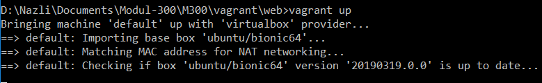
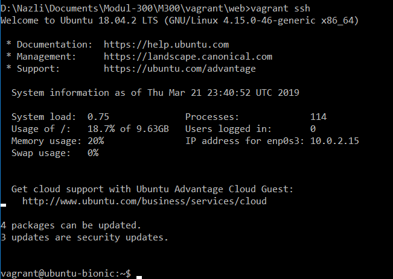
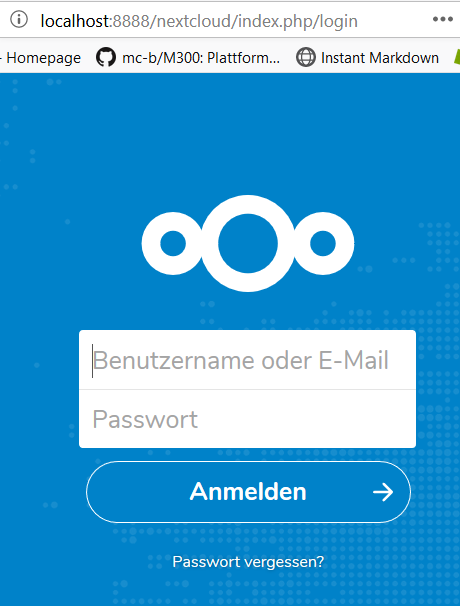
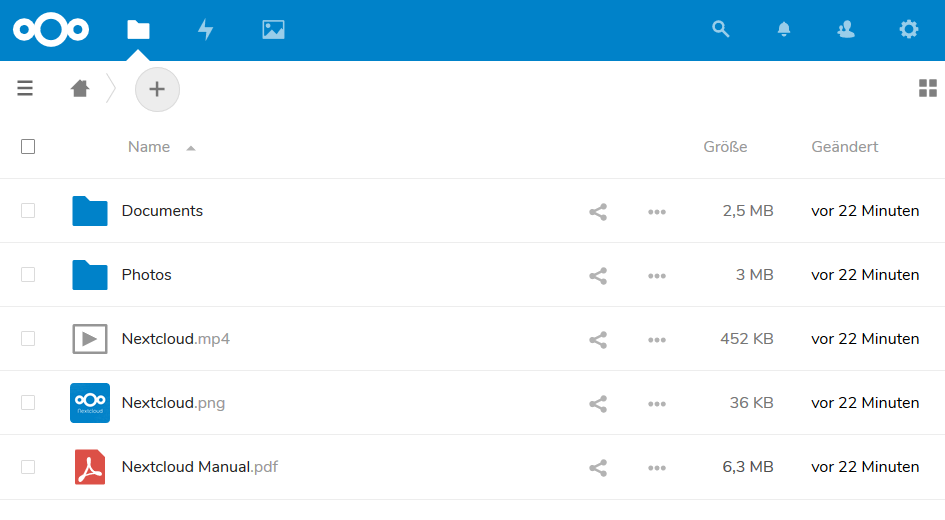
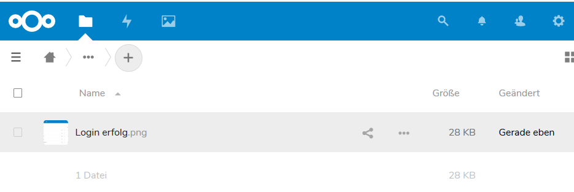

# Nextcloud installation #

## Einführung ##
In dieser Dokumentation geht es darum einen Webservice voll automatisiert aufzusetzen und mit einem kurzen Befehl aufsetzen zu lassen.
Mein Webservice, den ich ausgesucht habe, ist Nextcloud vorläufig wollte ich Owncloud installieren jedoch hat dies nicht funktioniert. Ich habe von einem klassen Kollegen den Tipp gekriegt, dass Netcloud einfacher ist zum einrichte als Owncloud.
Ich habe dies versucht und erfolgreich aufgesetzt.

In dieser Dokumentation erkläre ich Ihnen, wie ich vorgegangen bin. Was waren meine Schwierigkeiten und welche Lösungswege ich gegangen bin, um Probleme zu beheben.

# Inhhaltsverzeichniss
1. [Installation Nextcloud](#Installation)

    1.1 [Firewall Konfiguration](#FirewallKonfiguration)
    
    1.2 [Mysql Konfiguration](MysqlKonfiguration)
2. [Probleme Owncloud](#ProblemeOwncloud)
3. [Probleme Nextcloud](#ProblemeNextcloud)
4. [Persönlicher Wissensstand](PersönlicherWissensstand)
5. [Reflexion](#Reflexion)

## Installation Nextcloud 
Für die Installation habe ich zwei files verwendet. Einerseits das "Vagrantfile", welches die Konfiguration der VM vor gibt. Und zusätzlich habe ich ein "Config.sh" File in welchem die komplette Installation des Webservices vorhanden ist.

Meine Linux Version, welche ich verwendet habe ist "bionic64". Da die Kompatibilität von Nextcloud mit diesem Betriebssystem besser gewährleistet ist.

Dazu ist wichtig zu beachten, dass ich den Port von 80 auf den Port 8888 weitergeleitet habe, da der Port 8080 meistens schon verwendet wird.

    Vagrant.configure(2) do |config|
     config.vm.box = "ubuntu/bionic64"
     config.vm.network "forwarded_port", guest:80, host:8888, auto_correct: true  
    config.vm.provider "virtualbox" do |vb|
     vb.memory = "2048"  
    end

Mit diesem Befehl welcher im "Vagrantfile" eingetragen ist, wird angegeben das die restlichen Konfigurationen vom "Config.sh" File bezogen werden sollen.

    config.vm.provision :shell, path: "config.sh"
    end

Nun kommen wir zu de eigentlichen Installation des Webservices.

Dieser Eintrag veranlasst das das alle Installationen und Konfiguration direkt als Root ausgeführt werden.

    sudo su

        
### Firewall Konfiguration 
Damit standardmäßig die Firewall alle Verbindungen blockiert, kann man dies Konfigurieren indem man die unten stehenden Befehle eingibt.

    #Konfiguration Firewall
    #Rein kommende und Rusgehenden verbindungen ablehnen
    sudo ufw default deny incoming
    sudo ufw default deny outgoing

Es ist Wichtig das man die https verbindung nach aussen zulässt, damit keine Probleme bestehen, jedoch wird die Verbindung über http erfolgen.

    #https verbindung nach aussen erlauben
    ufw allow out on enps03 to any port 80
    ufw allow out on enps03 to any port 443

Damit die Verbindung zum Mysql Server  vom Webbrowser erfolgen kann, muss man diese auf der Firewall auch zulassen. Ich habe hier den Port 8888 genommen, da ich im Vorhinein diesen konfiguriert hab. Somit ist es wichtig das der Port 8888 Freigegeben ist.

    #mysql verbindung nach innen erlauben
    sudo ufw allow in on enps03 to any port 8888

Um den zugriff auf die VM einzuschränken erstellen wir hier eine Firewall Regel, welche nur dem Host-Gerät erlaubt auf das Gerät per SSH zuzugreifen.

    #Erlaube SSH verbindung nur von diesem Computer
    sudo ufw allow in on enps03 from 127.0.0.1 to any port 2222

Um die Firewall Regeln zu aktivieren gibt man diesen Befehl ein.

    #Firewall aktivieren
    sudo ufw enable

### Mysql Konfiguration 
Als Erstes startet man ein Update damit die virtuelle Maschine auf dem neuesten Stand ist. Der nächste Schritt ist das Root Passwort des Mysql Servers zu setzen. Die beiden angaben sind nur dafür da, damit das Passwort bestätigt wird.

    #mysql installation mit root passwort
    sudo apt-get update
    sudo debconf-set-selections <<< 'mysql-server mysql-server/root_password password nSscVjjraPVQ6CEAkktL'
    sudo debconf-set-selections <<< 'mysql-server mysql-server/root_password_again password nSscVjjraPVQ6CEAkktL'

Nun kann die Installation des Mysql Servers durchgeführt werden.

    sudo apt-get -y install mysql-server

Hier wird Mysql erlaubt eine Verbindung von der IP-Adresse 0.0.0.0 herzustellen. Da dies passiert, wenn z.B. keine IP vorhanden ist.

    #Erlaube mysql verbindung von 0.0.0.0
    sudo sed -i "s/.*bind-address.*/bind-address = 0.0.0.0/" /etc/mysql/mysql.conf.d/mysqld.cnf

Nun wird ein Datenbank Benutzer erstellt mit dem Usernamen und seinem Passwort. Zusätzlich wird mit "CREATE DATTABASE <DBName>" die Datenbank erstellt.

Alle Privilegien werden bewilligt für den localhost um auf die Datenbank zuzugreifen.

    #Erstelle nextclooud Benutzer; Datenbank erlaube alle berechtigung auf localhost
    mysql -uroot -pnSscVjjraPVQ6CEAkktL -e "CREATE DATABASE nextcloud";
    mysql -uroot -pnSscVjjraPVQ6CEAkktL -e "CREATE USER 'nextcloud'@'localhost' IDENTIFIED BY '6mYOGLPtvrqdx89WES6L'"
    mysql -uroot -pnSscVjjraPVQ6CEAkktL -e "GRANT ALL PRIVILEGES ON nextcloud.* TO 'nextcloud'@'localhost'"

Nun muss die Datenbank neu gestartet werden, damit alle Konfigurationen übernommen werden.

    #mysql neustarten
    service mysql restart

Um Nextcloud anzeigen zu können, muss Apache 2 und PHP installiert werden. Diese sind benötigt für die Anzeige im Webbrowser.
Dazu werden noch Plugins installiert damit Mysql kompatibel ist mit PHP.

    sudo apt-get install apache2 libapache2-mod-php7.2 -y
    sudo apt-get install php7.2-gd php7.2-json php7.2-mysql php7.2-curl php7.2-mbstring -y
    sudo apt-get install php7.2-intl php-imagick php7.2-xml php7.2-zip -y

Mit dem folgenden befehl werden die Konfigurationen in die "default.conf" umgeleitet damit Apache2 die Ausgabe im Browser machen kann.

    #Echo umleiten auf apache default conf
    sed -i '8iRedirectMatch ^/$ /nextcloud/' /etc/apache2/sites-enabled/000-default.conf

Hier wird von der Webseite die verschiedenen Versionen von Nextcloud aufgerufen und das benötigte Zip file heruntergeladen und ausgepackt.

    #Nextcloud herunterladen und entzippen
    cd /var/www/html
    wget https://download.nextcloud.com/server/releases/nextcloud-15.0.5.tar.bz2 -O nextcloud.tar.bz2
    tar -xjf nextcloud.tar.bz2

Nun werden würden Nextcloud Ordner die Lese rechte zugeteilt. Dies ist benötigt damit die Apache Konfigurationen übertragen werden können.

    #Berechtigungen Setzen
    chown -R www-data:www-data /var/www/html/nextcloud
    chmod 750 /var/www/html/nextcloud -R

Die Tar Datei sollte nun entfernt werden, um unnötigen Speicherverlust zu verhindern.

    #tar Datei entfernen
    rm -f -r nextcloud.tar.bz2

Für Nextcloud sollte auch ein Datenspeicher erstellt werden, um in der Cloud Sachen zu speichern. Dazu werden noch zusätzlich die benötigten Berechtigungen gesetzt.

    #Daten Ordner erstellen und rechte setzen
    mkdir /Nextcloud
    chown www-data:www-data /Nextcloud
    chmod 750 /Nextcloud
Weiter oben haben wir die Erlaubnis gegeben, die Konfiguration aus dem Ordner vom Nextcloud Ordner zu lesen. Diese werden nun für Apache in ein Config File geschrieben.

    #nextcloud apache Konfigurationen setzen
    echo "Alias /nextcloud "/var/www/html/nextcloud/"

    <Directory /var/www/html/nextcloud/>
     Options +FollowSymlinks
     AllowOverride All

    <IfModule mod_dav.c>
     Dav off
    </IfModule>

    SetEnv HOME /var/www/html/nextcloud
    SetEnv HTTP_HOME /var/www/html/nextcloud

    </Directory>" > "/etc/apache2/sites-available/nextcloud.conf"

Das Config File wurde nun erstellt und wird mit folgendem Befehl Freigeschalten damit Apache damit Arbeiten kann.

    #nexloud Konfiguration freischalten
    a2ensite nextcloud.conf

Der Apache Service wird neugestaltet damit die vorgenommenen Änderungen gespeichert und übernommen werden.

    #Apache Server
    service apache2 restart

Dies ist der Teil in welchem man den Nextcloud User erstellt mit seinem Passwort. Dazu wird mit dem zuvorerstellten "Pass" erlaubt diese zu erstellen.

    #Nextcloud Konfigurieren
    sudo -u www-data php /var/www/html/nextcloud/occ maintenance:install --database "mysql" --database-name "nextcloud" --database-user "nextcloud" --database-pass "6mYOGLPtvrqdx89WES6L" --database-host localhost --admin-user "admin" --admin-pass "Test1234" --data-dir "/Nextcloud"

## Testing 
| Soll-Zustand  | Ist-Zustand  |
|---|---|
| Vagrant up             | Vagrant up hat Funktioniert                | 
| Vagrant SSH            | Vagrant SSH hat Funktioniert               |
| Nextcloud zugriff      | Nextcloud zugriff hat Funktioniert         |
| Login                  | Login hat Funktioniert                     |
| Dateien Hochladen auf Nextcloud      | Dateien Hochladen auf Nextcloud hat Funtioniert.         |

Ich habe Vagrant up gemacht und die VM hat konnte ohne Probleme starten.

Die Vagrant ssh Verbindung konnte hergestellt werden.

Der Zugriff auf Nextcloud hat Funktioniert über den angegebenen Port.

Mit dem Angegebenen User Anmelden hat Funktioniert.

Login mit User hat Funktioniert.

Datei in eine AblageHochladen hat Funktioniert.

## Probleme 
In diesem Abschnitt der Dokumentation werde ich erzählen, was in diesem Projekt schief gelaufen ist und was ich zur Behebung der Probleme gemacht habe.

Anfangs wollte ich Owncloud als Cloud verwenden jedoch hatte ich da einige Schwierigkeiten ich habe in die Owncloud Installation sehr viel Zeit investiert. Ich habe verschiedenste Dokumentationen verwendet, mit welchen ich versucht habe das Ergebnis zu erzielen.

Der erste Problem Punkt war, dass die Datenbank nicht wie gewünscht sich Installieren lassen wollte. Ich hatte anfangs auch Mysql verwendet, nur ist die Installation ohne eine Error Meldung abgestürzt. Leider konnte ich da nicht viel machen.
Als Problem Lösung habe ich weitere Dokumentationen gesucht mit, welchen ich Owncloud installieren könnte und bin darauf gestoßen MariaDB zu verwenden. Die Installation hatte ohne Probleme funktioniert.

as zweite Problem war mit der MariaDB da ich nicht wusste, wie ich die Berechtigungen setzen kann. Ich habe viel gegoogelt und mich informiert jedoch bin ich leider nicht füündig geworden und habe wieder zu Mysql gewechselt.

Nachdem ich eine funktionierende Installation von Mysql gefunden habe, musste ich rausfinden wie ich die Berechtigungen und die Datenbank Konfigurationen über das Vagrantfile bzw. meine Config.sh einfüge.

Nachdem ich die Datenbank Probleme behoben hatte, wollte der Eintrag für Apache nicht Funktionieren. Der Eintrag war im "Ownclod.conf" eingetragen jedoch, wenn ich versucht habe auf den Localhost zuzugreifen bekam ich nur eine Leerseite, somit habe ich festgestellt das meine Zeit zu knapp wird, wenn die Probleme sich weiterhin so ziehen.

Schluss und endlich habe ich einen Klassenkameraden von der Paralell klasse gefragt der auch eine Cloud aufgesetzt hat. Er hat mir den Tipp gegeben, mit Nextcloud zu arbeiten das das Aufsetzen ein einfacherer Prozess sei als bei Owncloud.

## Probleme Nextcloud 
Dank dem Tipp des Kollegen in der parallel Klasse haben sich meine Probleme mit Nextcloud tatsächlich vermindert. Leider hat die Installation nicht von Anfang an einwandfrei funktioniert.

Das eine Problem war, das ich das falsche Betriebssystem verwendet habe. Nextcloud ist leider mit der Linux Version "Xenial64" nicht kompatibel. Ich musste für die Installation von Nextcloud auf "bionic64" wechseln.
Dieses Problem habe ich gefunden bei der Suche nach Anleitungen für die Installation für Nextcloud.

Dannah hatte ich nur noch ein Zweites Problem unzwar habe ich einem eintrag der berechtigung vergessen "Localhost" einztragen somit hat die Verbindung auf den Owncloud Server nicht Funktioniert bzw. der Zugriff wurde nicht gewährt.

    mysql -uroot -pnSscVjjraPVQ6CEAkktL -e "GRANT ALL PRIVILEGES ON nextcloud.* TO 'nextcloud'@'localhost'"

## Persönlicher Wissensstand 
|  Themen | Gelernt  |
|---|---|
|  Linux   | Da wir mit Linux gearbeitet haben hat sich mein Wissenstand über Linux automatisch erweitert. Vorallem mit der Datenbank integration.       | 
|  Virtualisierung  |  In diesem Modul hatt sich mein Wissen über Virtualisierung nur im Automatisierten bereich erweitert. Grundsätzlich hatte ich vor kurzem ein Virtualisieruungs Modul und dadurch ist mein Wissen erweitert worden.      |
|  Vagrant   |  Vagrant hatte ich vorher gar nicht gekannt. Ich wusste, dass es Automatisierungs-Tools gibt jedoch noch keines kennengelernt Vagrant ist das erste, welches ich kennen gelernt habe.        |
|  Versionsverwaltung    |  Ich weiss in der Theorie was Versionsveraltung ist, je4doch habe ich nie Damit gearbeitet.        |
|  Mark Down     | Mark Down habe ich Persönlikch nicht gekannt. Ich kannte die art dieser Dokumentation. Dank diesem Modul konnte ich selbst mal so eine Art von Dokumentation         |
| Systemsicherheit | Ich kannte im vorhien die Firewall von inux schon und hatte diese auch schon Konfiguriert, dadurch war das für mich kein grosser Leneffekt. |

## Reflexion 
Ich habe den Webservice Nextcloud installiert. Vorläufig war geplant Owncloud zu installieren, jedoch durch gewisse Schwierigkeiten habe ich das Ziel mit Owncloud nicht erreicht.Nextcloud war einffacher zu installieren und konnte somit das Ziel erreichen.

Ich habe gelernt wie ich eine Mysql DB über Vagrant konfigurieren kann. Dassheisst mit Zugriffs berechtigungen und die Freigabe über den Webbrowser.

Ich habe Festgestellt, dass ich ich zu extrem auf Owncloud fixiert habe. Dies hat dazu geführt, dass ich für die Nextcloud konnfiguration und somit für die Dokumentation zu wenig Zeit hatte. Das bedeutet für mich, dass ich mich in zukunft um eine Zweite Variante verlassen soll und nicht an die erst beste Lösung klammern soll.